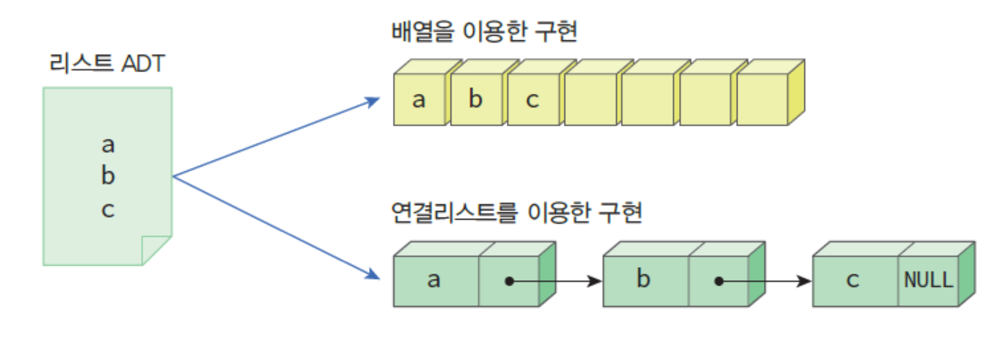

# 2022-11-07(월요일)

## 리스트 (배열 리스트)

리스트는 우리들이 자료를 정리하는 방법 중의 하나이다.

리스트에는 항복들이 차례대로 저장되어 있다. 리스트의 항목들은 순서 또는 위치를 가진다.
앞에서 살펴본 스택과 큐도 넓게 보면 리스트의 일종이다.

---

### 리스트의 ADT

▪ insert(list, pos, item) ::= pos 위치에 요소를 추가한다.
▪ insert_last(list, item) ::= 맨 끝에 요소를 추가한다.
▪ insert_first(list, item) ::= 맨 처음에 요소를 추가한다.
▪ delete(list, pos) ::= pos 위치의 요소를 제거한다.

▪ clear(list) ::= 리스트의 모든 요소를 제거한다.
▪ get_entry(list, pos) ::= pos 위치의 요소를 반환한다.
▪ get_length(list) ::= 리스트의 길이를 구한다.
▪ is_empty(list) ::= 리스트가 비었는지를 검사한다.
▪ is_full(list) ::= 리스트가 꽉 찼는지를 검사한다.
▪ print_list(list)::= 리스트의 모든 요소를 표시한다.

---

### 배열 구현 방법



 리스트는 **배열**과 **연결리스트**를 이용하여 구현할 수 있다. **배열**을 이용하면 리스트 ADT를 가장 간단히 구현할 수 있다. 하지만 크기가 고정되는 점은 단점이다.
 다른 방법으로는 **포인터**를 이용하여 연결 리스트를 만드는 방법이 있다. 연결 리스트는 필요할 때마다 중간에 속지를 추가해서 사용할 수 있는 바인더 공책과 비슷하다

---

 

### 배열로 구현된 리스트


배열을 이요하여 리스트를 구현하면 순차적인 메모리 공간이 할당되므로, 이것을 리스트의 순차적 표현이라고도 한다.
 배열을 사용하면 리스트의 항목을 아주 자연스럽게 저장할 수 있다.

---

### 리스트의 정의

배열로 리스트를 구현하기 위하여 배열과 항목의 개수를 구조체로 묶어서 ArrayListType이라는 새로운 타입을 정의하도록 하자.

```c
#define MAX_LIST_SIZE 100 // 리스트의 최대크기
typedef int element; // 항목의 정의

typedef struct {
	element array[MAX_LIST_SIZE]; // 배열 정의 
	int size; // 현재 리스트에 저장된 항목들의 개수
} ArrayListType;
```

---

### 배열로된 리스트의 기초 연산

```c
//오류처리함수
void error(char *message) {
	fprintf(stderr, "%s\n", message);
	exit(1); 
}

// 리스트 초기화 함수
void init(ArrayListType *L) { 
	L->size = 0;
}

//리스트가비어있으면1을반환, 그렇지않으면0을반환
int is_empty(ArrayListType *L) { 
	return L->size == 0;
}

//리스트가가득차있으면1을반환, 그렇지않으면0을반환
int is_full(ArrayListType *L) {
	return L->size == MAX_LIST_SIZE;
}

element get_entry(ArrayListType *L, int pos) { 
	if (pos < 0 || pos >= L->size)
		error("위치 오류"); 
	return L->array[pos];
}

// 리스트 출력
void print_list(ArrayListType *L) { 
int i;
	for (i = 0; i<L->size; i++) 
		printf("%d->", L->array[i]);
	printf("\n"); 
}

void insert_last(ArrayListType *L, element item) { 
	if( L->size >= MAX_LIST_SIZE ) {
		error("리스트 오버플로우"); 
	}
	L->array[L->size++] = item; 
}
```

---

### 항목 추가 연산

```c
void insert(ArrayListType *L, int pos, element item) { 
	if (!is_full(L) && (pos >= 0) && (pos <= L->size)) {
		for (int i = (L->size - 1); i >= pos; i--) 
			L->array[i + 1] = L->array[i];
		L->array[pos] = item;
		L->size++; 
	}
}
```

---

### 항목 삭제 연산

```c
element delete(ArrayListType *L, int pos) { 
element item;
	if (pos < 0 || pos >= L->size) error("위치 오류");
		item = L->array[pos];
	for (int i = pos; i<(L->size - 1); i++)
		L->array[i] = L->array[i + 1]; 
	L->size--;
	return item; 
}
```