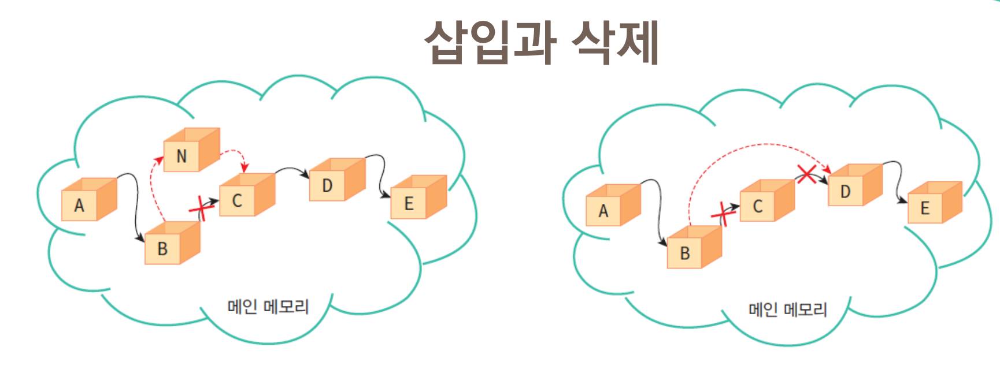
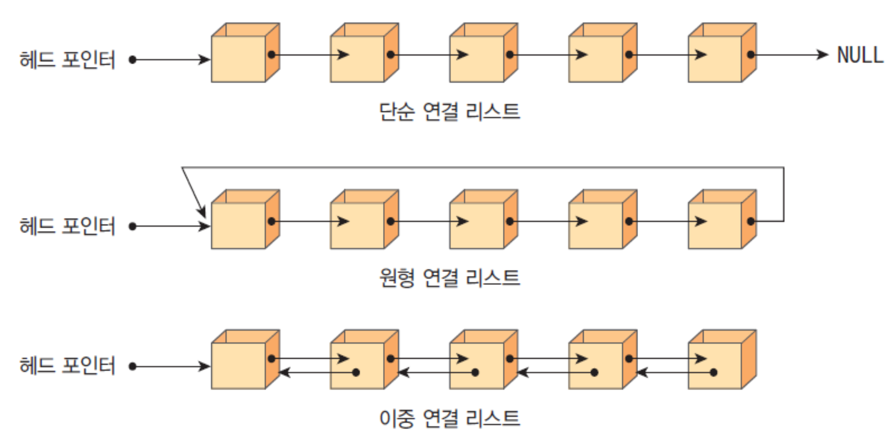

# 2022-11-08(화요일)

## 리스트(연결 리스트)

연결 리스트로 리스트를 구현시 동적으로 크기가 변할 수 있고 삭제나 삽입 시에 데이터를 이동할 필요가 없다.
연결된 표현은 포인터를 사용하여 데이터들을 연결한다. **연결된 표현**은 널리 사용되며 추상 데이터 타입 “리스트”의 구현에만 사용되는 것이 아니고 다른 여러 가지의 자료구조(트리, 그래프, 스택, 큐) 등을 구현하는데도 많이 사용된다.

**연결된 표현**은 일단 데이터를 한군데 모아두는 것을 포기하는 것이다. 데이터들은 메인 메모리상의 어디에나 흩어져서 존재할 수 있다. 이런 식으로 물리적으로 흩어져 있는 자료들을 서로 연결하여 하나로 묶는 방법을 **연결 리스트**라고 한다. 상자를 연결하는 줄은 **포인터**라고 한다.



---

## 연결된 표현의 장단점

[장점]

- 삽입, 삭제가 보다 용이하다.
- 연속된 메모리 공간이 필요 없다.
- 크기 제한이 없다.

[단점]

- 구현이 어렵다.
- 오류가 발생하기 쉽다.

---

## 연결 리스트의 구조


앞에 그림에서 처럼 상자를 컴퓨터 용어로 노드라고 부른다. **연결 리스트**는 이들 노드들의 집합이다.
**노드**들은 메모리의 어떤 위치에나 있을 수 있으며 다른 노드로 가기 위해서는 현재 노드가 가지고 있는 포인터를 이용하면 된다. **노드는 데이터 필드와 링크 필드로 구성**되어 있다.

---

## 연결 리스트의 종류



---

## 연결 리스트의 구현

### [노드의 정의]

```c
typedef int element;

typedef struct ListNode { // 노드 타입을 구조체로 정의한다. element data;
	struct ListNode *link;
} ListNode;
```

### [리스트의 생성]

```c
ListNode *head = NULL;

head = (ListNode *)malloc(sizeof(ListNode));

head->data = 10; 
head->link = NULL;
```

### [2번째 노드 생성]

```c
ListNode *p;
p = (ListNode *)malloc(sizeof(ListNode)); 
p->data = 20;
p->link = NULL;
```

### [노드의 연결]

```c
head->link = p;
```

### [연결 리스트 삽입 연산]

```c
ListNode* insert_first(ListNode *head, int value) { 
	ListNode *p =
		(ListNode *)malloc(sizeof(ListNode)); p->data = value;
	p->link = head; 
	head = p;
	return head; 
}
```

### [연결 리스트의 삽입연산2]

```c
ListNode* insert(ListNode *head, ListNode *pre, element value) {
	ListNode *p =
		(ListNode *)malloc(sizeof(ListNode));
	p->data = value; 
	p->link = pre->link; 
	pre->link = p; 
	return head;
}
```

### [연결 리스트의 삭제 연산]

```c
ListNode* delete_first(ListNode *head) { 
	ListNode *removed;
	if (head == NULL) return NULL;
	removed = head;
	head = removed->link; free(removed);
	return head;
}
```