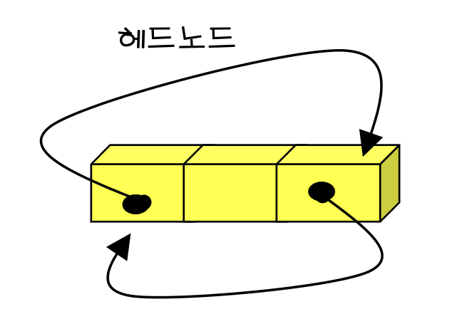
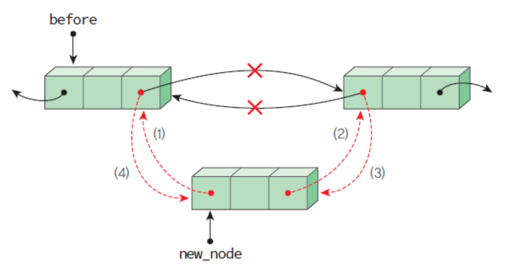
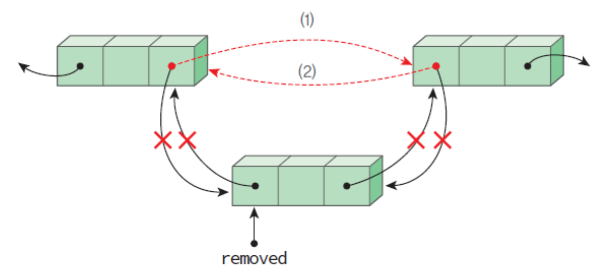

# 2022-11-10(목요일)

## 이중 연결 리스트

단순 연결 리스트에서 어떤 노드에서 후속 노드를 찾기는 쉽지만, 선행 노들르 찾으려면 구조상 아주 어렵다.
원형 연결 리스트라고 하더라도 거의 전체 노드를 거쳐서 돌아 오야 한다. 따라서 응용 프로그램에서 특정 노드에서 양방향으로 자유롭게 움직일 필요가 있다면 단순 연결 리스트 구조는 부적합하다. 이중 연결 리스트는 이러한 문제점을 해결하기 위하여 만들어진 자료구조이다.


즉, 하나의 노두가 선행 노드와 후속 노드에 대한 두 개의 링크를 가지는 리스트이다.

[단점] : 공간을 많이 차지하고 코드가 복잡해진다는 것이다.

---

## 헤드 노드

- 데이터를 가지지 않고 단지 삽입, 삭제 코드를 간단하게 할 목적으로 만들어진 노드
- 헤드 포인터와의 구별 필요하다.
- 공백 상태에서는 헤드 노드만 존재한다.



---

### 이중연결리스트에서의 노드의 구조

```c
typedef int element; 

typedef struct DListNode {
	element data;
	struct DListNode *llink; 
	struct DListNode *rlink;
} DListNode;
```

---

## 삽입 연산

```c
// 새로운 데이터를 노드 before의 오른쪽에 삽입한다.
void dinsert(DListNode *before, element data) {
	DListNode *newnode = (DListNode *)malloc(sizeof(DListNode));
	strcpy(newnode->data, data);
	newnode->llink = before; 
	newnode->rlink = before->rlink; 
	before->rlink->llink = newnode; 
	before->rlink = newnode;
}
```



---

## 삭제 연산

```c
// 노드 removed를 삭제한다.
void ddelete(DListNode* head, DListNode* removed) {
	if (removed == head) 
		return; 
	removed->llink->rlink = removed->rlink; 
	removed->rlink->llink = removed->llink; 
	free(removed);
}
```



---

## 전체 프로그램

```c
#include <stdio.h> 
#include <stdlib.h>

typedef int element; 
typedef struct DListNode { // 이중연결 노드 타입
	element data;
	struct DListNode* llink; 
	struct DListNode* rlink;
} DListNode;

// 이중 연결 리스트를 초기화
void init(DListNode* phead) { 
	phead->llink = phead; 
	phead->rlink = phead;
}

// 이중 연결 리스트의 노드를 출력
void print_dlist(DListNode* phead) {
	DListNode* p;
	for (p = phead->rlink; p != phead; p = p->rlink) {
		printf("<-| |%d| |-> ", p->data); 
	}
		printf("\n"); 
}

// 새로운 데이터를 노드 before의 오른쪽에 삽입한다.
void dinsert(DListNode *before, element data) {
	DListNode *newnode = (DListNode *)malloc(sizeof(DListNode)); 
	newnode->data = data;
	newnode->llink = before;
	newnode->rlink = before->rlink;
	before->rlink->llink = newnode;
	before->rlink = newnode; 
}

// 노드 removed를 삭제한다.
void ddelete(DListNode* head, DListNode* removed) {
	if (removed == head) 
		return; 
	removed->llink->rlink = removed->rlink; 
	removed->rlink->llink = removed->llink; 
	free(removed);
}

// 이중 연결 리스트 테스트 프로그램
int main(void) {
	DListNode* head = (DListNode *)malloc(sizeof(DListNode)); 
	init(head);

	printf("추가 단계\n");
	for (int i = 0; i < 5; i++) {
		dinsert(head, i); // 헤드 노드의 오른쪽에 삽입
		print_dlist(head); 
	}

	printf("\n삭제 단계\n"); 
	for (int i = 0; i < 5; i++) {
		print_dlist(head);
		ddelete(head, head->rlink); 
	}

	free(head);
	return 0; 
}
```