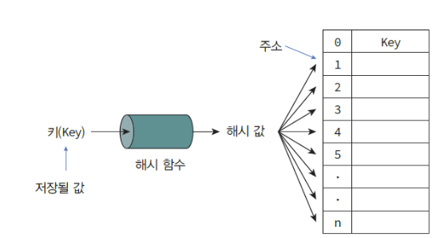
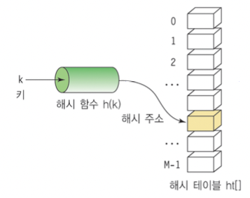

# 2022-11-28(월요일)

## 해싱

지금까지 배운 우리가 학습한 선형 탐색이나 이진 탐색은 모두 키를 저장된 키값과 반복적으로 비교함으로써 탐색하고자 하는 항목에 접근한다. 이런 방법들은 최대 가능한 시간 복잡도가 O(logn)에 그친다. 이 정도의 시간 복잡도만 되어도 괜찮은 응용도 있지만, 어떤 응용에서는 더 빠른 탐색 알고리즘을 요구한다.

**해싱**은 O(1)의 시간 안에 탐색을 끝마칠 수 있다.

**해싱**은 **키**에 산술적인 연산을 적용하여 항목이 저장되어 있는 테이블의 주소를 계산하여 항목에 접근한다. 이렇게 키에 대한 연산에 의해 직접 접근이 가능한 구조를 ***해시 테이블***이라 부르며, 해시 테이블을 이용한 탐색을 **해싱**이라고 한다. 해싱은 많은 응용 프로그램에서 사용된다. 예를 들어서 텀파일러가 사용하는 심볼 테이블, 철자 검사기, 데이터베이스 등에서 해싱을 사용한다.

---

## 해싱의 예[사전]

사전은 **(키, 값)** 쌍의 집합이다. 사전은 키와 관련된 값을 동시에 저장하는 자료 구조이다. (키, 값) 쌍을 지정할 수도 있고 (키, 값) 쌍을 삭제할 수도 있으며 키를 가지고 값을 검색할 수 있다. 사전은 **맵(map)**이나 **테이블(table)**로 불리기도 한다.

---

## 해싱의 구조

해싱은 자료를 저장하는데 배열을 사용한다. 배열은 단점도 잇지만 만약 원하는 항목이 들어 있는 위치를 알고 있다면 매우 빠르게 자료를 삽입하거나 꺼낼 수 있다. 이 경우, 배열의 다른 요소들에는 전혀 접근할 필요가 없다.

해싱이란 이런 식으로 어떤 항목의 키만을 가지고 바로 항목이 들어 있는 배열의 인덱스를 결정하는 기법이다. **해시 함수**란 키를 입력으로 받아 해시 주소를 생성하고 이 해시 주소를 해시 테이블의 인덱스로 사용한다. 이 배열의 인덱스 위치에 자료를 저장할 수도 있고 거기에 저장된 자료를 꺼낼 수도 있다.

