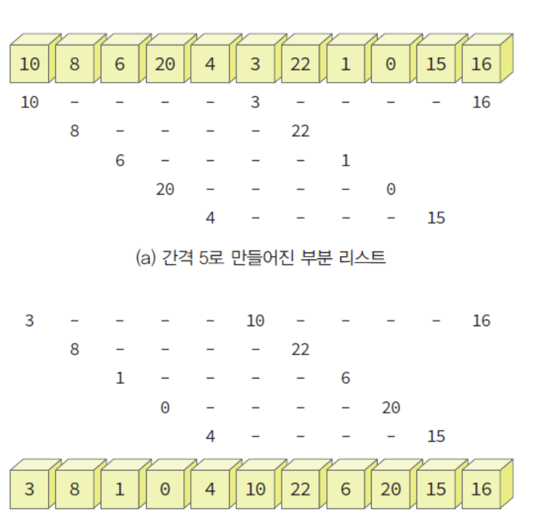
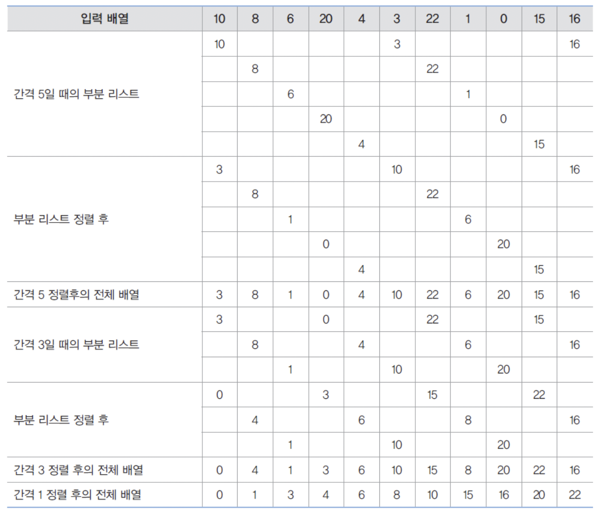

# 2022-10-19(수요일)

## 쉘 정렬

쉘 정렬은 Donald L. Shell이라는 사람이 제안한 방법으로 삽입 정렬이 어느 정도 정렬된 배열에 대해서는 대단히 빠른 것에 착안한 방법이다. 쉘 정렬은 삽입 정렬의 O(n^2)보다 빠르다.

삽입 정렬의 최대 문제점은 요소들이 삽입될 때, 이웃한 위치로만 이동한다는 것이다.
만약 삽입되어야 할 위치가 현재 위치에서 당항히 멀리 떨어진 곳이라면 많은 이동을 해야 만이 제자리로 갈 수 있다. 쉘 정렬에서는 요소들이 멀리 떨어진 위치로도 이동할 수 있다.

삽입정렬과는 다르게 쉘 정렬은 전체의 리스트를 한 번에 정렬하지 않는다. 대신에 먼저 정렬해야할 리스트를 일정한 기준에 따라 분류하여 연속적이지 않은 여러 개의 부분 리스트를 만들고, 각 부분 리스트를 삽입 정렬을 이용하여 정렬한다. 모든 부분 리스트가 정렬되면 쉘정렬은 다시 전체 리스트를 더 적은 개수의 부분 리스트로 만든 후에 알고리즘을 되풀이한다.
위의 과정은 부분 리스트의 개수가 1이 될 때까지 되풀이 한다.

---

 



---



---

## 쉘 정렬의 구현

gap이 간격을 나타낸다. shell_sort 함수에서는 간격이 1이 될 때까지 간격을 1/2로 줄이면서 반복한다. 부분 리스트의 개수는 gap이 된다. 각 부분 리스트에 대하여 일정한 간격으로 떨어져 있는 요소들을 삽입 정렬하는 함수은 inc_insertion_sort를 호출하였다. inc_insertion_sort 함수는 앞의 사입 정렬 함수와 비교하여 보면 쉽게 이해할 수 있다. 만약 간격이 짝수이면 1을 더하는 것이 좋은 것으로 분석되었다.

---

## 코드

```c
// gap 만큼 떨어진 요소들을 삽입 정렬 // 정렬의 범위는 first에서 last
inc_insertion_sort(int list[], int first, int last, int gap) { 
	int i, j, key;
	for(i=first+gap; i<=last; i=i+gap){ 
		key = list[i];
		for(j=i-gap; j>=first && key<list[j];j=j-gap) 
			list[j+gap]=list[j];
		list[j+gap]=key; 
	}
}

void shell_sort( int list[], int n ) { 
	int i, gap;

	// n = size
	for( gap=n/2; gap>0; gap = gap/2 ) { 
		if( (gap%2) == 0 ) gap++;

		for(i=0;i<gap;i++) 
			inc_insertion_sort(list, i, n-1, gap);
	} 
}
```